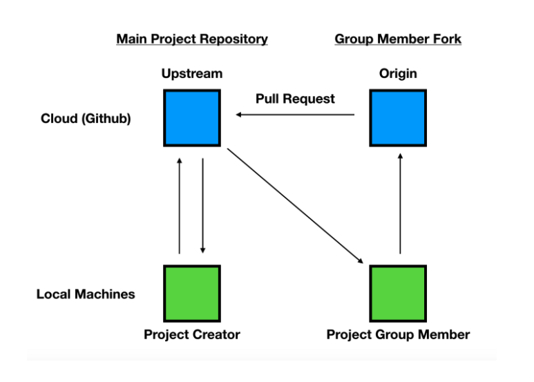

# Casa-Verde Project Frontend part

## GitHub Workflow

## Daily Routine

## => Remote Origin (Your forked repository)

- I strongly recommend: Create a main a development branches that will not be touched. They will be connected with the main project repository’s main and development branch.
  - main branch: Will only be updated weekly after the spring retro with all features, it is the main application.
  - development branch: Will be updated daily with all the features that you complete.
  - # Features branches (**_“your-name”-“front/backend”-“feature-name”_**). Having the features divided into branches will help to organize and to catch bugs, so the features are isolated from the development branch.

### Steps:

- git commands:

  1. git status: Check if you local branches are synced with the remote origin branches.

  2. # git push --force origin **_“branch-name”_**: Force push to update the history of the remote repository branch.
  3. git pull origin **_"branch-name"_**: Pull from the forked remote origin branch in order to update your local branch.
  4. git merge **_"branch-to-merge"_**: Merge the changes that were fetched from the remote origin branch.
  5. git add . && git commit -m **_"message"_**: Commit all the changes you have on you local branch.
  6. git pull origin **_"branch-name"_**: Updating your remote origin branch with you latest code.
     If there were mistakes with the commit message:
  7. git commit -amend -m **_"message"_**: Edit you last commit message if there were mistakes.
  8. git push --force origin **_"branch-name"_**: Force push to update the history of the remote repository branch.

## => Remote Upstream (Main repository for the project)

<h2>Coming soon...</h2>
